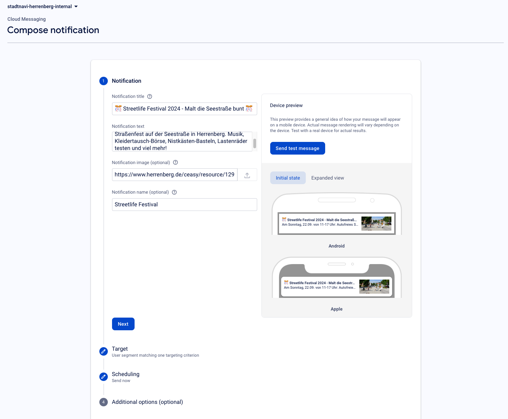
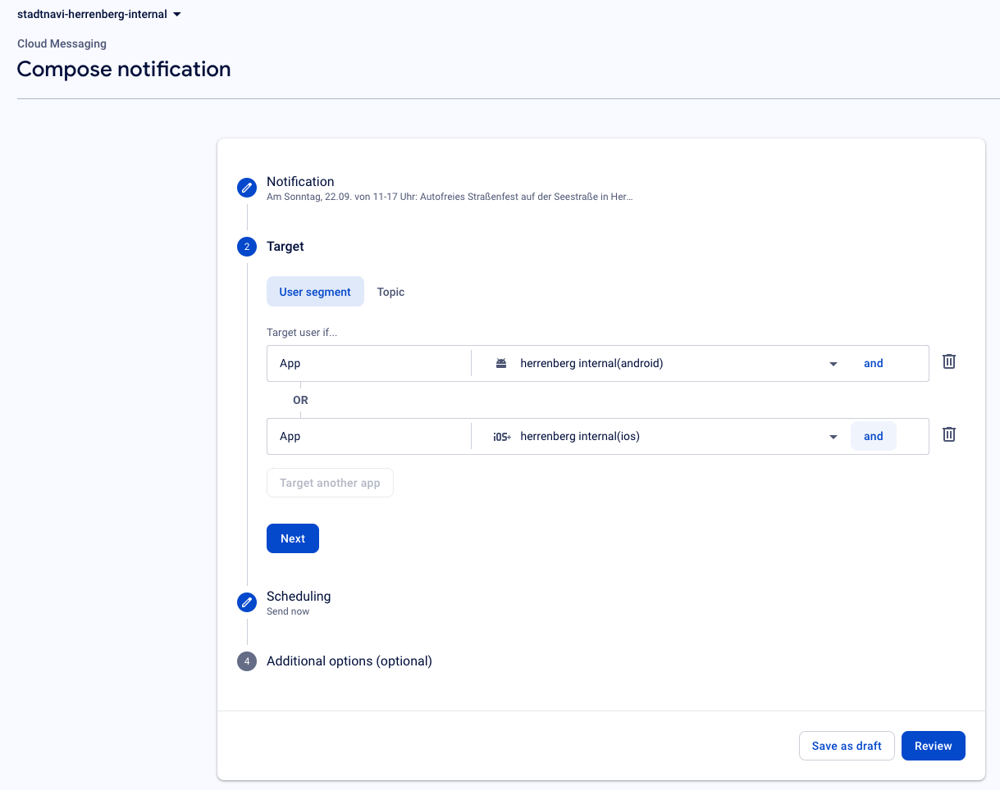
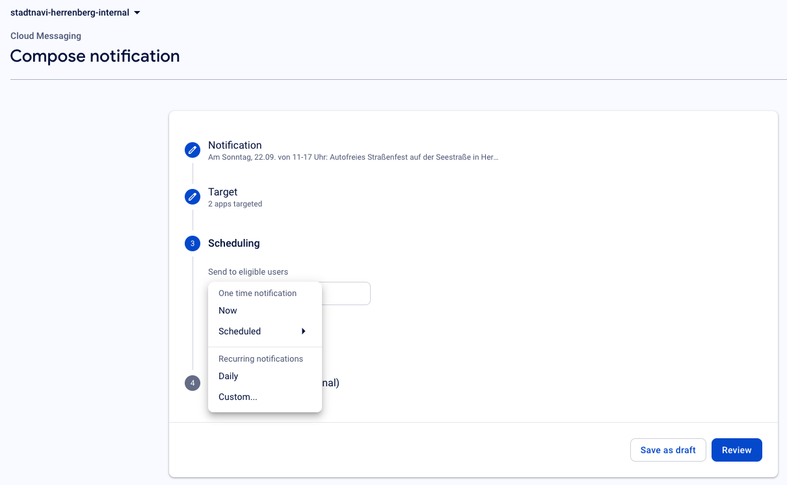
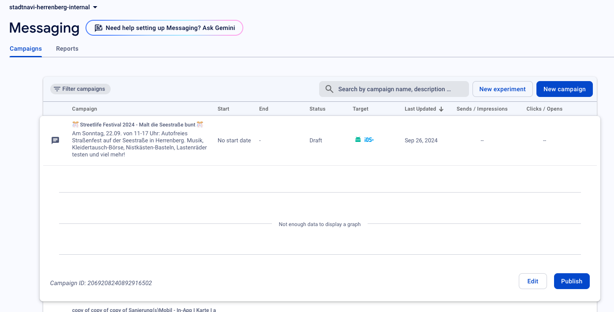
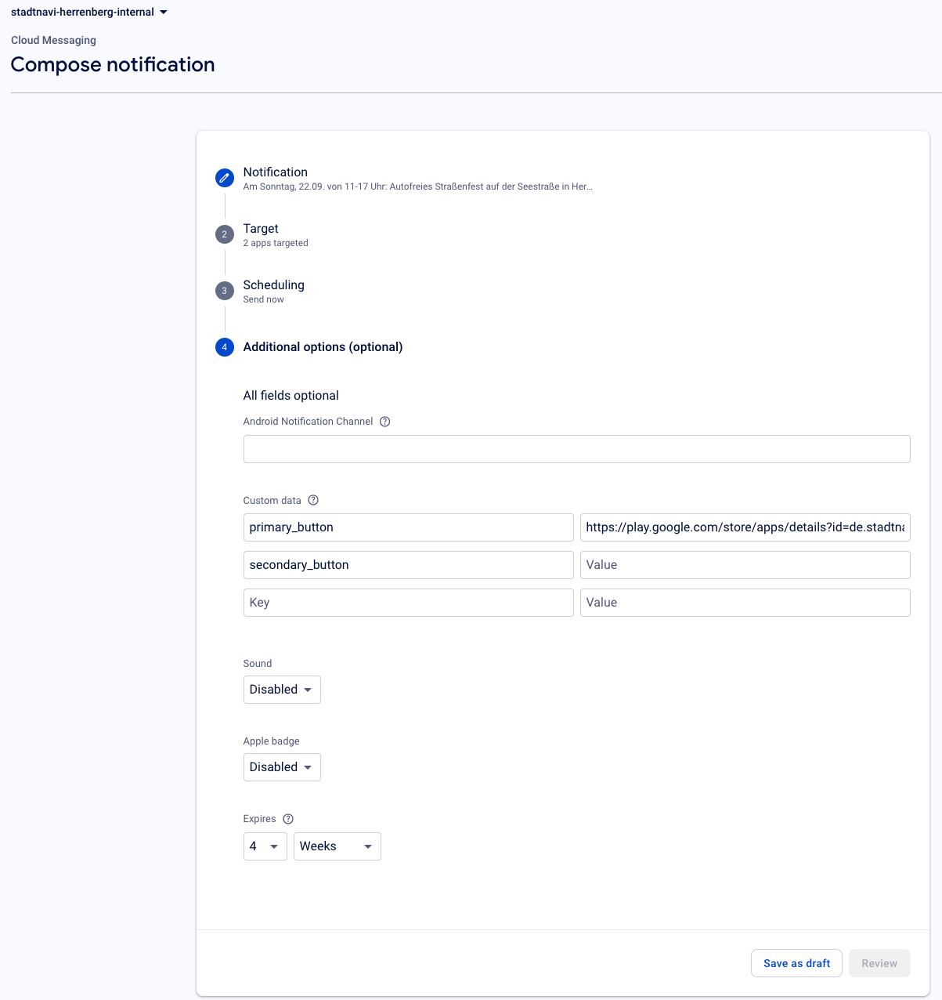

# Push Notifications Configuration Guide for Clients

This guide will walk you through the process of creating and sending push notifications from the Firebase Console to your app using the stadtnavi-core package. It includes easy steps to configure the notification content and customize the experience for your users.

---

## 1. Introduction
With Firebase, you can send push notifications to users even when your app is not open. Notifications can be customized to include text, images, and actions like opening a link.

In this guide, we'll explain how you can create and send notifications using the Firebase Console.

---

## 2. Getting Started with Firebase
To begin, make sure you have access to the **Firebase Console** for your project. Here’s how to get started:

1. **Open Firebase Console:**
   - Visit [Firebase Console](https://console.firebase.google.com/).
   - Log in with your credentials.

2. **Select Your Project:**
   - From the list of projects, select the project related to your app.
   - If you don't have a project, please contact your technical team to assist with creating one.

---

## 3. Creating and Sending Notifications
Once you’re in the Firebase Console, you can create and send notifications with the following steps:

### Step 1: Open the Cloud Messaging Section
1. On the left menu, click on **Cloud Messaging**.   
2.	Click on the **New campaign** button at the top. This will open a popup.
3.	In the popup, select **Notifications** to start creating a new message.

### Step 2: Fill in the Notification Details
   
Fill in the details for the notification in Notification-Section:

- **Notification title (Optional):** The title of the notification. Example: *New Updates Available!*
- **Notification text (Required):** The main message. Example: *Check out the latest features in the app.*
- **Notification image (Optional):** You can add an image URL here if you want a visual element.
- **Notification name (Optional):** A name to identify the notification.

### Step 3: Target Your Audience
   
1. **Select Your Audience:** You can choose to send the notification to users on:
   - Only Android devices,
   - Only iOS devices,
   - Or both platforms simultaneously.

### Step 4: Scheduling
   
In this section, you can decide when to send your notification. Firebase provides the following options:

1.	**One-time Notification:**
      - **Now:** Send the notification immediately.
      - **Scheduled:** Choose a specific date and time to send the notification in the future.
2.	**Recurring Notifications:**
      - **Daily:** Set the notification to repeat daily at a specified time.
      - **Custom:** Define a custom schedule based on your needs.

### Step 4: Save and Send the Notification
   
After filling in the notification details and selecting your audience, you can proceed with the following steps:

1. **Save as Draft:** Click **Save as Draft** to save the notification without sending it. This will close the popup, and your notification will appear as the first item in the notifications list.
   
2. **Publish:** To send the notification, locate it in the list and click **Publish**. If the notification is scheduled, it will be sent at the specified date and time.
---

## 4. Additional Notification Options
   

In the **Additional Options** section, you can include **custom data** for more advanced actions:

1. **Primary Button:**
   - If you want to add a button, set a key-value pair. 
   - Example: `primary_button: <URL>` will open the URL when the user presses the button.

2. **Secondary Button:**
   - You can add a second button with another key-value pair.
   - Example: `secondary_button: <URL>` will work like the primary button.

These buttons will allow users to interact with the notification by opening a web link or closing the popup if no URL is provided.
---

## 5. Understanding Notification Behavior

Depending on whether the app is open or not, the notification will behave differently:

1. **When the app is open:** 
   - Instead of a traditional notification, a **popup** will be displayed immediately with the information from the notification.

2. **When the app is closed or in the background:** 
   - A notification will be received in the system tray. When the user taps on it, the app will open, and the popup will show the notification details.

